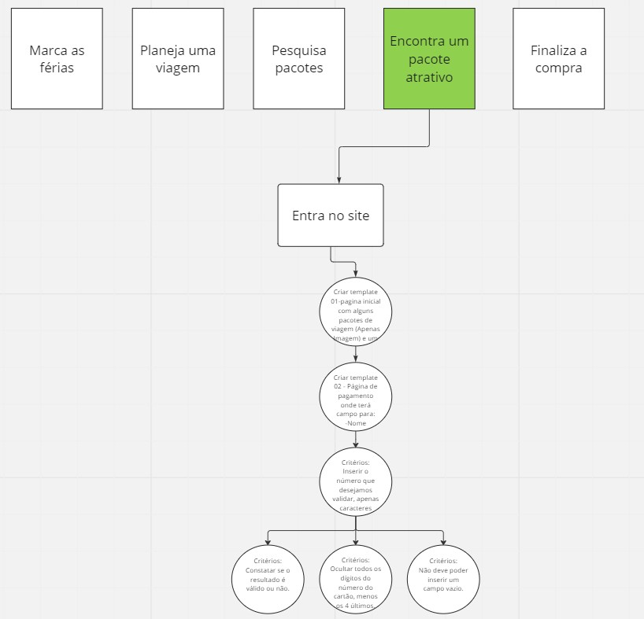

# Card Validator

## 1. Introdução
O projeto 01 da turma 10 da Laboratoria foi desenvolvido com base no algoritimo de Luhn para validar o número de cartão de credito.

O [algoritmo de Luhn](https://en.wikipedia.org/wiki/Luhn_algorithm), também
chamado de módulo 10, é um método de soma de verificação, usado para validar
números de identificação, como o IMEI de telefones celulares, cartões de crédito
etc.

Esse algoritmo é simples. Obtemos o inverso do número a ser verificado (que
contém apenas dígitos [0-9]); todos os números que ocupam uma posição par devem
ser multiplicados por dois; se esse número for maior ou igual a 10, devemos
adicionar os dígitos do resultado; o número a verificar será válido se a soma de
seus dígitos finais for um múltiplo de 10.
 
 
## 2. Resumo do projeto
O projeto foi desenvolvido um web site para que o usuario/cliente final B2C onde o site vende para o consumidor final, onde será escolhido dentre algumas opções o pacote de viagens e intuitivamente clicar no botão "comprar" o mesmo irá para a próxima tela onde irá realizar a validação do cartão de crédito.

* Os principais usuarios serão clientes que buscam férias, promoções e viagens;

* O objetivo do usuario ao acessar o site é fazer a busca do melhor pacote de viagens que lhe interesse e realizar a compra;

* O site desenvolvido para o produto consiste em facilitar a escolha de uma viagem incluindo voo + hospedagem em um só lugar.
 
 
## 3. Desenvolvimento do projeto
 
* Primeiramente realizei o benchmarking com sites com os mesmos nichos;
 

 
* Desenvolvi um prototipo para entender qual seria o fluxo da experiencia do usuario e para depois ajudar no desenvolvimento de pequenas tarefas;

* Realizei o desenvolvimento e funcionalidade do site e realizei alguns testes com pessoas reais para testar o produto.

 
 

## 4. Projeto final
  Com o link de acesso abaixo, o usuario pode acessar o site onde escolhe o pacote que deseja e na 2ª tela irá realizar a validação do cartão de crédito.

  Acesse o link abaixo e confira:

Link projeto: https://fernanda-canicais.github.io/SAP010-card-validation/

## 5. Ferramentas Utilizadas

  * HTML 
  * CSS 
  * JavaScript 
  * Miro 
  * Git 
  * Github 
